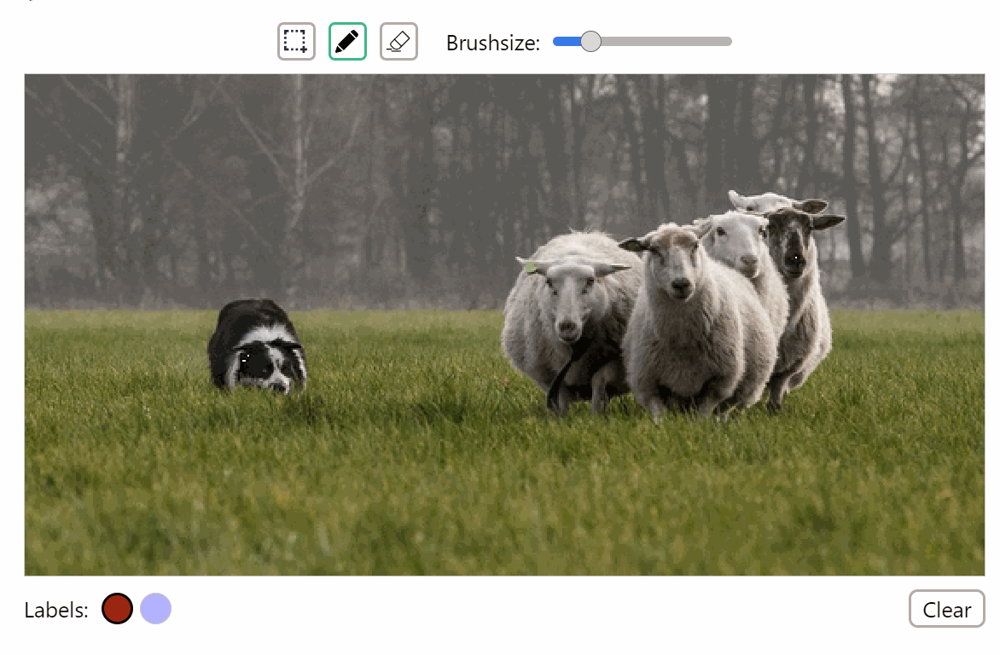

# jupyter-paint-segment


## Overview

A jupyter widget for interactive drawing segmentation masks.

Brush, rectangle and eraser tools are available.
Size of brush and eraser can be changed using slider.





---

## Installation

```sh
pip install jupyter_paint_segment
```
// TODO


---

## Usage

Load image into numpy array:
```python
import cv2 as cv

image = cv.imread("./examples/images/sheeps.png")
```

Define labels and colors (optionally) and create widget:
```python
from jupyter_paint_segment import SegmentWidget

widget = SegmentWidget(
	image=image,
	labels=["sheep", "dog"],
	colors=["red", "blue"],
	image_scale=1.3,
)
```

<< gif here >>


Get results:
```python
result_mask = widget.segmentation_result()
result_mask
```


---


